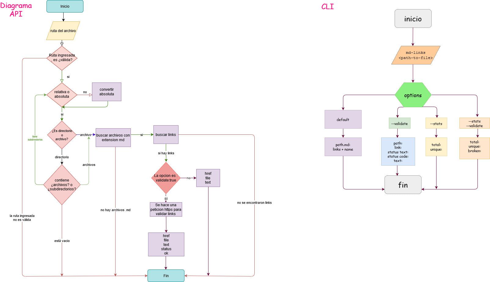
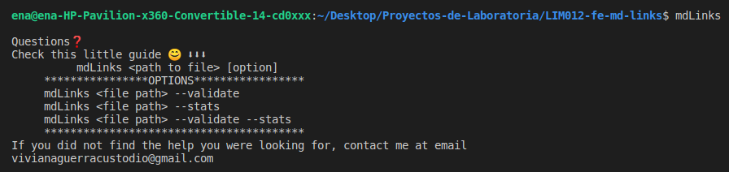
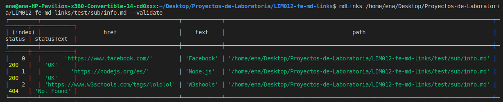
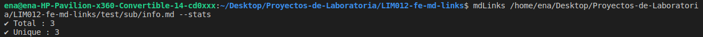
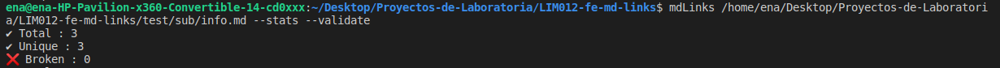

# Markdown Links

[Markdown](https://es.wikipedia.org/wiki/Markdown) es un lenguaje de marcado
ligero muy popular entre developers y es muy común
encontrar varios archivos en ese formato en cualquier tipo de repositorio
(empezando por el tradicional `README.md`).

Estos archivos normalmente contienen _links_ (enlaces web) que
muchas veces están rotos o ya no son válidos y eso perjudica mucho el valor de
la información que se quiere compartir.

Dentro de una comunidad de código abierto, nos han propuesto crear una
herramienta usando [Node.js](https://nodejs.org/), que lea y analice archivos
en formato `Markdown`, para verificar los links que contengan y reportar
algunas estadísticas.

## Planeación en Github Projects ➡️ [🗓️](https://github.com/VivianaGuerraCustodio/LIM012-fe-md-links/projects)

  

## ✔️ Diagrama de flujo 

  

### CLI
· Si en caso no se ingresa ruta alguna, al ejecutar el comando `mdLinks` en la terminal , aparecerá un mensaje como guía.

  

·  `mdLinks <path> --validate`

  

· `mdLinks <path> --stats`

  

· `mdLinks <path> --validate --stats`

  

## Entregables

Módulo instalable via `npm install <github-user>/md-links`. Este módulo debe
incluir tanto un ejecutable como una interfaz que podamos importar con `require`
para usarlo programáticamente.

## Objetivos de aprendizaje

### Javascript
- [✔️] Uso de callbacks
- [✔️] Consumo de Promesas
- [✔️] Creacion de Promesas
- [✔️] Modulos de Js
- [✔️] Recursión

### Node
- [✔️] Sistema de archivos
- [✔️] package.json
- [✔️] crear modules
- [✔️] Instalar y usar modules
- [✔️] npm scripts
- [✔️] CLI (Command Line Interface - Interfaz de Línea de Comando)

### Testing
- [✔️] Testeo de tus funciones
- [ ] Testeo asíncrono
- [ ] Uso de librerias de Mock
- [ ] Mocks manuales
- [ ] Testeo para multiples Sistemas Operativos

### Git y Github
- [✔️] Organización en Github

### Buenas prácticas de desarrollo
- [✔️] Modularización
- [✔️] Nomenclatura / Semántica
- [✔️] Linting

 <a href="https://forms.gle/Y8fZVKzJMrktxpRP9">Deja tu feedback por aquí  </a> 

 ✨✨✨✨✨✨✨✨✨✨✨✨ 

***

